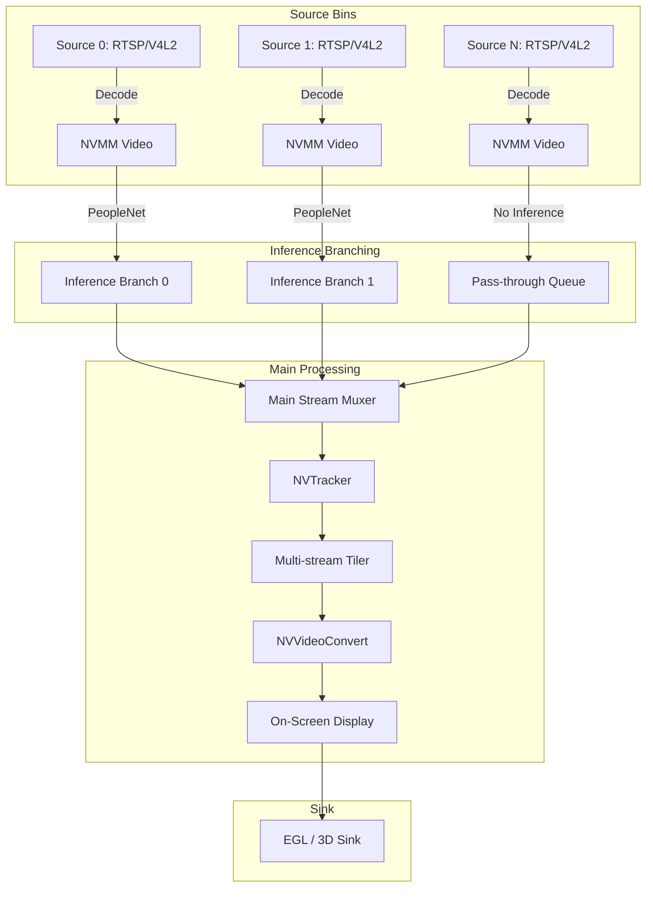

# Architectural Overview

This document outlines the high-level architecture of the Parallel RTSP Video Analytics application. The system is built upon a GStreamer pipeline architecture, heavily utilizing NVIDIA DeepStream plugins to ensure that video data remains in GPU memory as much as possible throughout the processing lifecycle.

## Pipeline Architecture

The pipeline follows a directed acyclic graph (DAG) structure, processing frames from decode to display.

## Core Components

1.  **Source Bins (`create_source_bin`)**:
    *   Dynamically created for each input argument.
    *   For `v4l2://`, it utilizes `v4l2src`, `jpegdec`, and `nvvideoconvert` to push raw frames into NVMM (NVIDIA Memory Management).
    *   For `rtsp://`, it relies on `uridecodebin` handling payload parsing, depacketization, and invoking the appropriate hardware decoder (e.g., `nvv4l2decoder`).

2.  **Inference Branching (`create_inference_branch`)**:
    *   This is a unique architectural choice. Instead of passing a large batched tensor of all streams to a single inference engine, the architecture splits streams *before* the main muxer.
    *   Each selected branch gets its own local `nvstreammux` (batch size 1), an `nvinfer` engine, and an `nvstreamdemux`. This allows different streams to be processed by completely different AI models concurrently.

3.  **Main Stream Muxer (`nvstreammux`)**:
    *   Aggregates the individual, asynchronously inferred streams back into a single synchronized batch frame.

4.  **Tracker (`nvtracker`)**:
    *   Tracks objects identified by the preceding `nvinfer` plugins across consecutive frames, attaching unique IDs to metadata.

5.  **Visualization & Output**:
    *   `nvmultistreamtiler`: Composites the batch into a 2D grid image.
    *   `nvdsosd`: Draws the bounding boxes, text, and tracking IDs derived from the inference and tracking metadata onto the tiled frame.
    *   `nveglglessink` / `nv3dsink`: Renders the final output directly to the display manager without moving frame data back to system CPU RAM.
